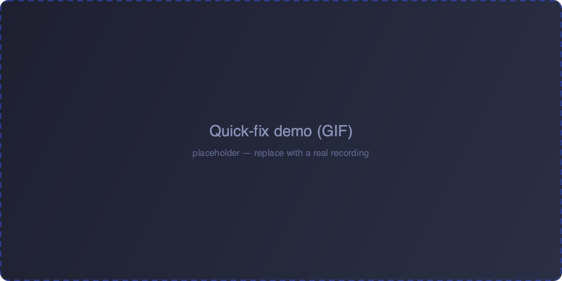
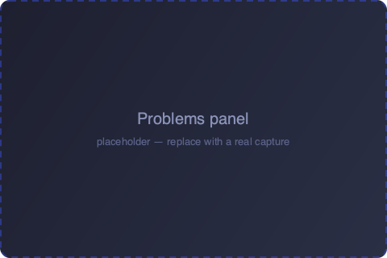
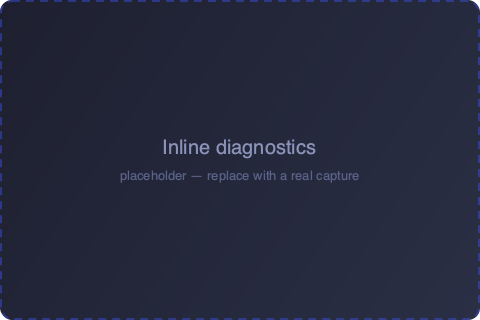
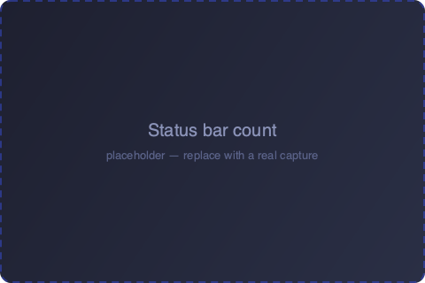

# Context Check

**Your AGENTS.md is telling your agent things that aren't true.**

Lint AI agent context files (`AGENTS.md`, `CLAUDE.md`, and friends) against your
**actual repository** — right inside VS Code. Deterministic, offline, no API keys.

---

Agent context files drift. You rename an npm script, move a folder, switch from
Jest to Vitest — but the `AGENTS.md` you handed your AI still points at the old
world. Your agent then confidently runs commands that no longer exist.

**Context Check verifies every claim in your context file against what's really
in the repo**, and flags the ones that have gone stale — as you type, in the
Problems panel, with one-click quick fixes.

Everything runs locally. **Zero network calls, no API keys, no telemetry, no sign-up.**

  

## Features

- **Stale command detection** — a command like `npm run build` that no longer
  exists in `package.json`. Suggests the closest real script
  (*"did you mean `build:prod`?"*).
- **Dead path detection** — a referenced file or directory that isn't there.
- **Case-mismatch paths** — a path that resolves on macOS but breaks
  case-sensitive Linux CI (a real, silent bug class).
- **Quick fixes** — replace a stale command with the suggested task, or remove a
  dead-path reference, in one click (from the editor lightbulb or the sidebar).
- **Dedicated sidebar** — a Context Check icon in the Activity Bar opens a
  **Findings** view grouping every issue by file. Refresh the whole workspace
  from its title bar, click a finding to jump to it, or hit the inline wrench to
  apply its fix — without opening the file.
- **Status bar count** — see at a glance how many issues the active context file has.
- **Check the whole workspace** — one command lints every `AGENTS.md` / `CLAUDE.md` at once.
- **Deterministic & explainable** — every finding maps to a rule you can read.
  No LLM guessing.

## Getting Started

1. **Install** Context Check from the Marketplace (or run
   `code --install-extension jubinsoni.contextcheck`).
2. **Open a repo** that has an `AGENTS.md` or `CLAUDE.md` at its root.
3. **Open the context file.** Findings appear immediately in the editor and the
   **Problems** panel, and refresh every time you save.
4. **Fix issues** with the lightbulb (⌘.) quick fixes, or run
   **Context Check: Check workspace** from the Command Palette to scan everything.

  

## Screenshots

  
  
  

## Commands

| Command | Description |
| --- | --- |
| `Context Check: Check workspace` | Scan every context file in the workspace and report all findings. Also available as the refresh button in the sidebar. |

## What it checks

| Rule | Severity | Meaning |
| --- | --- | --- |
| `stale-command` | Error | A command names a task the repo doesn't define. Suggests the closest match. |
| `dead-path` | Error / Warning | A referenced path doesn't exist. Error for explicit paths, warning for prose mentions. |
| `case-mismatch-path` | Error | A path exists but with different casing — breaks case-sensitive CI. |

## Settings

| Setting | Default | Description |
| --- | --- | --- |
| `contextcheck.enable` | `true` | Enable or disable Context Check diagnostics. |

## Privacy

Context Check runs **entirely on your machine**. It reads your context files and
your repository's manifests (`package.json`, etc.) to verify claims. It makes
**no network requests**, stores no data, and sends no telemetry.

## Requirements

- VS Code `1.85.0` or newer.
- A workspace containing an `AGENTS.md` or `CLAUDE.md` file.

## Explicitly out of scope

No LLM calls, no API-key prompts, no sign-up. Every check is deterministic and
explainable — false positives are treated as bugs.

## Contributing

Issues and pull requests welcome at
[github.com/jubins/contextcheck](https://github.com/jubins/contextcheck).

## License

[MIT](LICENSE) © Jubin Soni
